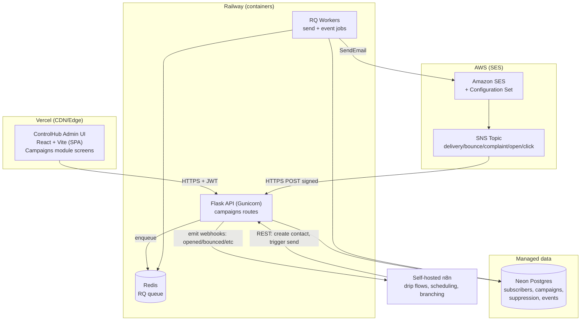
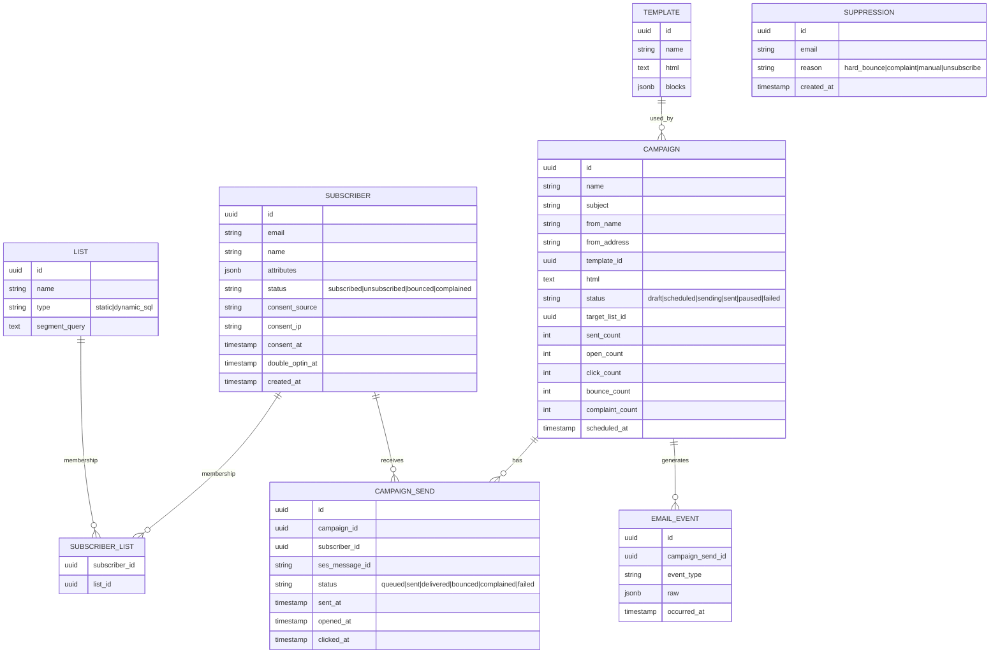
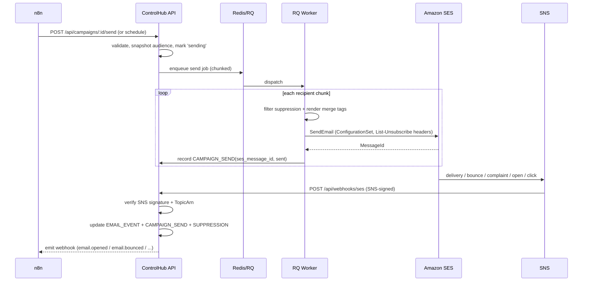

# ControlHub — Email Campaigns Module (Native "Mailchimp") — Design & Delivery Plan

**Owner:** Web Forx Technology Limited
**Status:** Plan / pre-implementation (no build yet)
**Path chosen:** Path B — native module inside ControlHub (Flask), sending via Amazon SES
**Date:** 2026-07-16

> This is a planning document. It defines target architecture, the exact AWS IAM footprint, secrets placement, data model, sending pipeline, the n8n orchestration contract, and the enterprise UI spec — so implementation is a straight execution of decisions already made here.

---

## 1. Recommended solution (summary)

Build a **native, feature-flagged `email_campaigns` module inside the existing Flask app**, reusing what ControlHub already has (SQLAlchemy/Postgres, Redis + RQ workers, `boto3`, `secret_crypto`, RBAC, service accounts + API keys, audit logging, S3 asset storage, the React dark-theme admin UI). Amazon SES is the sending backbone. **n8n owns automation/orchestration** (scheduling, delays, branching, drip); the module owns the campaign/contact data, the send engine, deliverability hygiene (suppression), and analytics.

Deployment topology (confirmed decisions):

| Layer | Runs on | Why |
|---|---|---|
| Admin UI (React/Vite) | **Vercel** | Static SPA; ideal for Vercel's edge/CDN. Never touches AWS creds. |
| ControlHub API (Flask/Gunicorn) | **Railway** | Long-running stateful app — cannot run on Vercel serverless. |
| Background workers (RQ) | **Railway** (separate service) | Batch sends, event processing — need a persistent worker. |
| Database (Postgres) | **Neon** (recommended) or Supabase | Managed Postgres; drop-in for existing SQLAlchemy/Alembic. |
| Queue/cache (Redis) | **Railway Redis** or Upstash | RQ requires Redis. |
| Email delivery + events | **Amazon SES** (+ SNS) | Rented deliverability; pay-per-send. |
| Automation/orchestration | **Self-hosted n8n** | Owns drip flows, scheduling, branching via API + webhooks. |

**Critical correction to the brief:** the AWS access key lives in **Railway's** encrypted variables (that's where SES is called from), **not** in Vercel. Vercel only gets the public API base URL. Putting AWS keys in a browser-delivered frontend would expose them.

### Why Neon over Supabase here
ControlHub already owns its auth (JWT), storage (S3), and data layer. It only needs **plain managed Postgres**, which is exactly Neon's sweet spot (autoscaling, connection pooling, and DB branching for dev/stage/prod). Supabase also works with zero code change (it's Postgres too), but its extra surface (GoTrue auth, storage, realtime) duplicates things ControlHub already has. Pick Supabase only if you later want its auth/storage/realtime for other modules. Either way: use the **pooled connection string** and enforce SSL.

---

## 2. Target architecture



**Two Railway services, one repo:** a `web` service (`gunicorn wsgi:app`) and a `worker` service (`rq worker campaigns default`). Both read the same env group. This mirrors the existing `Dockerfile.api` + RQ setup already in the repo.

---

## 3. AWS IAM — everything the sender needs

Because compute runs on **Railway (non-AWS)**, we cannot use an instance/task role. We use a **dedicated IAM user with programmatic access only** and a **least-privilege** policy, and we store its access key in Railway secrets.

### 3.1 Identity setup (one-time, in AWS console/CLI)
1. Verify the **sending domain** in SES (e.g. `mail.webforx.tech`) and publish the SES-provided **DKIM** CNAMEs + **SPF** + a **DMARC** record in your DNS (Route 53 or current DNS host).
2. Create an SES **Configuration Set** (e.g. `controlhub-prod`) with an **event destination → SNS topic** for `send, delivery, bounce, complaint, open, click, reject`.
3. Request **SES production access** (removes sandbox; sub-50k/month is well within default quotas — verify current quota in the SES console).
4. Create IAM user `controlhub-ses-sender` — **no console access**, access key only.

### 3.2 Least-privilege IAM policy (attach to the user)
Replace `<ACCOUNT_ID>`, `<REGION>`, and the domain/from-address placeholders.

```json
{
  "Version": "2012-10-17",
  "Statement": [
    {
      "Sid": "SendScopedToVerifiedIdentity",
      "Effect": "Allow",
      "Action": ["ses:SendEmail", "ses:SendRawEmail", "ses:SendBulkEmail"],
      "Resource": [
        "arn:aws:ses:<REGION>:<ACCOUNT_ID>:identity/mail.webforx.tech",
        "arn:aws:ses:<REGION>:<ACCOUNT_ID>:configuration-set/controlhub-prod"
      ],
      "Condition": {
        "StringEquals": { "ses:FromAddress": "campaigns@mail.webforx.tech" }
      }
    },
    {
      "Sid": "ReadQuotaAndStatsForDashboard",
      "Effect": "Allow",
      "Action": ["ses:GetSendQuota", "ses:GetSendStatistics", "ses:GetAccount"],
      "Resource": "*"
    }
  ]
}
```

Notes:
- The `ses:FromAddress` condition prevents the key from sending as any other address, even if leaked.
- `GetSendQuota`/`GetSendStatistics`/`GetAccount` don't support resource-level scoping (hence `*`); they're read-only and safe, used to show quota/health in the UI.
- SNS delivering to an HTTPS endpoint requires **no IAM permission on our side** — SNS pushes to our URL and we verify its signature. So no SQS/SNS API actions are needed in this policy. (If you later prefer a pull model, add an SQS queue subscribed to the topic and grant `sqs:ReceiveMessage`/`DeleteMessage` on that queue ARN only.)

### 3.3 Key hygiene
- Store only in Railway secrets (below). Never in git, never in Vercel, never in the DB.
- **Rotate every 90 days**: create a second access key, deploy it, then disable/delete the old one (zero-downtime rotation).
- Enable an AWS budget alarm and CloudWatch alarm on SES bounce/complaint rate.

---

## 4. Secrets & environment matrix

### 4.1 Railway — ControlHub API + Worker (where secrets actually live)
| Variable | Example / note |
|---|---|
| `AWS_ACCESS_KEY_ID` | from IAM user `controlhub-ses-sender` |
| `AWS_SECRET_ACCESS_KEY` | secret — Railway encrypted var |
| `AWS_REGION` | e.g. `us-east-1` |
| `SES_CONFIGURATION_SET` | `controlhub-prod` |
| `SES_FROM_ADDRESS` | `campaigns@mail.webforx.tech` |
| `SES_FROM_NAME` | `Web Forx` |
| `SES_SENDING_ENABLED` | `true` (kill-switch; `false` = dry-run) |
| `SNS_TOPIC_ARN` | used to validate inbound event `TopicArn` |
| `DATABASE_URL` | Neon **pooled** URL, `sslmode=require` |
| `REDIS_URL` | Railway Redis / Upstash |
| `N8N_BASE_URL` | e.g. `https://n8n.webforx.tech` |
| `N8N_API_KEY` | module → n8n calls (store in `secret_crypto` too) |
| `N8N_WEBHOOK_SECRET` | HMAC secret for n8n → ControlHub inbound verification |
| `CORS_ORIGINS` | add the Vercel domain(s) |
| *(existing)* | `SECRET_KEY`, `JWT_SECRET_KEY`, `SECRET_ENCRYPTION_KEYS` |

### 4.2 Vercel — Admin UI (NO AWS keys)
| Variable | Value |
|---|---|
| `VITE_API_BASE_URL` | `https://api.controlhub.webforx.tech` (Railway API) |

That's the whole frontend footprint. The browser calls ControlHub; ControlHub calls SES. AWS credentials never leave Railway.

---

## 5. Data model (native module)

Kept intentionally lean because **n8n owns flow logic** — the module stores contacts, campaigns, deliverability state, and events.



**Reused from existing code:** feature flag (`email_campaigns`), RBAC scopes (`campaigns:read`, `campaigns:write`, `campaigns:send`), audit logging on every mutating action, `secret_crypto` for n8n/API secrets, S3 for hosting email images/assets, and the existing notification system for internal "campaign finished / high bounce rate" alerts.

**Suppression is sacred:** every send filters against `SUPPRESSION` and `status != subscribed`. A hard bounce or complaint writes to `SUPPRESSION` immediately and is never emailed again.

---

## 6. Sending pipeline & event loop



Key implementation points:
- Use the **SESv2 `boto3` client** (`sesv2`), send with the configuration set attached so SES emits events natively (including **open/click tracking** — no need to build pixel/redirect infra ourselves).
- **Batch + throttle** in the worker to respect the SES per-second send rate; RQ ret/backoff on throttling exceptions.
- Every message carries **`List-Unsubscribe` + `List-Unsubscribe-Post`** (one-click) headers and a physical postal address in the footer (CAN-SPAM / Gmail-Yahoo bulk rules).
- **SNS webhook endpoint** must: confirm the subscription handshake once, verify the SNS message signature against the signing cert, and check `TopicArn == SNS_TOPIC_ARN` before trusting the payload.

---

## 7. n8n orchestration contract

n8n is the automation brain; ControlHub is the system of record and the sender.

**ControlHub → n8n (outbound webhooks):** on `subscriber.created`, `subscriber.unsubscribed`, `email.opened`, `email.clicked`, `email.bounced`, `email.complained`, `campaign.sent`. Signed with `N8N_WEBHOOK_SECRET` (HMAC-SHA256), so n8n can branch drip logic.

**n8n → ControlHub (REST API):** authenticated with a **service-account API key** (reusing ControlHub's existing service-accounts + API-keys module — no new auth needed). Core endpoints:
- `POST /api/subscribers` / `PATCH /api/subscribers/:id` — upsert contact + consent
- `POST /api/lists/:id/subscribers` — add/remove membership
- `POST /api/campaigns` / `POST /api/campaigns/:id/send` / `/schedule` — create & trigger
- `GET /api/campaigns/:id/stats` — pull analytics into a flow

n8n then owns: delays ("wait 2 days"), branching ("if opened → send B, else reminder"), multi-step nurture, and cross-channel steps — none of which the module has to build.

---

## 8. UI/UX spec — enterprise, intuitive, aesthetic

Extends the existing dark-theme React admin UI. Reuses current deps already in `admin-ui/package.json`: **recharts** (analytics), **framer-motion** (micro-interactions), **lucide-react** (icons), react-router.

New top-level nav section **"Campaigns"** with:

1. **Overview dashboard** — headline cards (sent, delivered %, open %, click %, bounce %, complaint %), trend charts (recharts), recent campaigns, and an SES health strip (quota used, sender reputation). Clear empty states.
2. **Subscribers** — fast searchable/filterable table, bulk import from CSV/XLSX (repo already ships `openpyxl`), a per-contact side drawer showing consent status, activity timeline, and list memberships.
3. **Lists & Segments** — static lists + a visual segment builder (filter chips → compiles to the `segment_query`), with live count preview.
4. **Campaign builder** — a guided 4-step wizard: **Details → Audience → Design → Review/Send**, with an inline test-send and a pre-send checklist (from address verified, unsubscribe present, suppression applied).
5. **Email editor** — drag-and-drop block editor built on **GrapesJS** (BSD-licensed, fully self-hosted, its newsletter/MJML preset). Chosen over Unlayer's `react-email-editor` because GrapesJS keeps content and rendering **inside our infrastructure** with no third-party hosted call — matching our data-sovereignty posture. Exports clean, inlined HTML for SES.
6. **Templates library** — reusable saved templates with thumbnails.
7. **Settings** — sending domain/DKIM/DMARC status, from-addresses, suppression-list viewer with manual add/remove, and the compliance footer (org address).

**Design principles:** consistent with existing ControlHub dark theme; WCAG AA contrast; inline validation and optimistic UI; keyboard-navigable tables; skeleton loaders; responsive down to tablet. Motion is subtle (150–200ms) and purposeful, never decorative.

---

## 9. Phased delivery plan

| Phase | Scope | Exit criteria |
|---|---|---|
| **0 — Foundations** | Feature flag, models + Alembic migrations, IAM user + SES domain verify + config set + SNS, Railway/Neon/Redis provisioning, env secrets wired | Domain verified (DKIM/SPF/DMARC green); `/api/webhooks/ses` confirms SNS subscription |
| **1 — Contacts & compliance** | Subscribers, lists/segments, CSV/XLSX import, suppression, double opt-in, one-click unsubscribe endpoint, consent capture | Can import, segment, unsubscribe; suppression enforced on a test send |
| **2 — Campaigns & sending** | Campaign builder, GrapesJS editor, RQ send pipeline via SESv2, event ingestion, analytics dashboard | End-to-end: build → send to a test list → live open/bounce stats |
| **3 — n8n orchestration** | Service-account API key, outbound signed webhooks, inbound REST endpoints, one reference drip flow in n8n | A 3-step drip runs end-to-end through n8n |
| **4 — Hardening & launch** | Load/throttle testing, rate-limit tuning, observability (structured logs/metrics), rollback runbook, security review, deploy Vercel + Railway | Acceptance criteria (§11) all pass |

---

## 10. Security & operational checklist

- [ ] IAM user least-privilege policy with `ses:FromAddress` condition; access key **only** in Railway secrets.
- [ ] 90-day key rotation procedure documented and tested (dual-key rollover).
- [ ] DKIM + SPF + DMARC published; DMARC starts at `p=none` for monitoring, then tighten.
- [ ] SNS webhook verifies signature + `TopicArn`; endpoint rate-limited (reuse `Flask-Limiter`).
- [ ] Suppression enforced pre-send; hard bounce/complaint → immediate suppression.
- [ ] `List-Unsubscribe` (one-click) on every message; physical address in footer.
- [ ] PII (subscriber data) — Neon encryption at rest + TLS in transit; GDPR export/delete endpoints.
- [ ] RBAC: `campaigns:send` gated to trusted roles; every mutation audit-logged.
- [ ] `SES_SENDING_ENABLED` kill-switch; CloudWatch alarms on bounce (>5%) / complaint (>0.1%) rates.
- [ ] n8n↔ControlHub traffic authenticated (API key one way, HMAC the other) over TLS only.
- [ ] Secrets never logged; `secret_crypto` used for stored n8n/API secrets.

---

## 11. Acceptance criteria

1. A verified domain sends a campaign to a 100-contact test list; delivery/open/click/bounce stats appear in the dashboard within minutes.
2. A hard bounce and a complaint each land the address in the suppression list and exclude it from the next send.
3. One-click unsubscribe removes the contact and is honored on subsequent campaigns.
4. n8n creates a contact, adds it to a list, and triggers a drip that sends based on an "opened" event — all via the documented API/webhooks.
5. No AWS credentials exist anywhere except Railway secrets; frontend bundle contains none.
6. Key rotation performed with zero send downtime.
7. Bounce rate < 5% and complaint rate < 0.1% on the test send.

---

## 12. Failure modes to plan for

- **SES sandbox** — until production access is granted, only verified recipients receive mail. Request early (1–2 day approval).
- **Cold domain** — even sub-50k, ramp gradually the first week; a large first blast to a new domain risks spam placement.
- **Throttling** — SES enforces a max send rate; the worker must back off, not hammer.
- **Duplicate SNS deliveries** — SNS is at-least-once; event processing must be idempotent (dedupe on `ses_message_id` + event type).
- **Railway worker restarts** — send jobs must be resumable/idempotent so a mid-batch restart doesn't double-send (track per-recipient `CAMPAIGN_SEND` state before calling SES).

---

## 13. Cost note (verify before finalizing)

At sub-50k emails/month, SES cost is on the order of a few dollars/month (SES was ~$0.10 per 1,000 emails in my reference data — **confirm current pricing in the AWS SES pricing page**). Railway, Neon, and n8n hosting dominate the bill, not SES. No dedicated IP needed at this volume.

---

*Next step after sign-off: begin Phase 0 (models + migrations + IAM/SES/SNS provisioning). No code is written until this plan is approved.*
